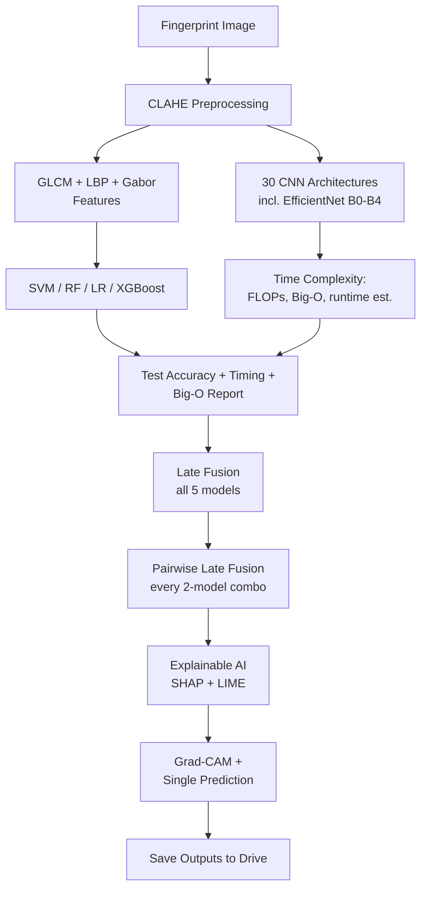

# 🩸 Blood Group Detection Using Fingerprint

Extended: Multi-Architecture Comparison + Explainable AI + Pairwise Fusion

An end-to-end pipeline that predicts a person's blood group (`A+ A- B+ B- AB+ AB- O+ O-`) from a fingerprint image — combining classic hand-crafted-feature ML models with a 30-architecture CNN comparison, late fusion, and full explainability (SHAP, LIME, Grad-CAM).

---

## 1. Methodology



---

## 2. Description

- **Task** = 8-class classification of blood group from fingerprint image
- **Classes** = `A+, A-, B+, B-, AB+, AB-, O+, O-`
- **Image size** = 128 × 128, CLAHE-enhanced grayscale
- **Feature-based models** = SVM, Random Forest, Logistic Regression, XGBoost (154 hand-crafted GLCM + LBP + Gabor features)
- **CNN models** = 30 architectures trained and compared (see table below)
- **Final selection protocol** = 9 shortlisted CNNs re-evaluated across **3 seeds each** (27 runs total) to avoid picking a "lucky" single run — ranked by mean ± std accuracy
- **Fusion** = accuracy-weighted late fusion, both all-5-models and every pairwise 2-model combination
- **Explainability** = SHAP (Tree/Kernel/Gradient explainers) + LIME (tabular + image) + Grad-CAM

---

## 3. CNN Architectures Compared (30 total)

| Family | Models |
|---|---|
| Paper Baseline | PaperCNN (lightweight CNN from paper) |
| Classic | LeNet-5, AlexNet |
| Segmentation Encoder | UNet |
| VGG | VGG11, VGG13, VGG16, VGG19 |
| ResNet | ResNet18 (original), ResNet34, ResNet50, ResNet101 |
| GoogLeNet / Inception | GoogLeNet, InceptionV3 |
| DenseNet | DenseNet121, DenseNet169, DenseNet201 |
| MobileNet | MobileNetV2, MobileNetV3-Small/Large |
| EfficientNet | B0, B1, B2, B3, B4 |
| SqueezeNet | 1_0, 1_1 |
| ShuffleNet | ShuffleNetV2 |
| RegNet | RegNetY-400MF |
| ConvNeXt | ConvNeXt-Tiny |

**Shortlisted for final multi-seed comparison (9):** DenseNet-121, MobileNetV2, ResNet-18, ResNet-50, EfficientNet-B0 → B4 — each run 3× with seeds `42, 123, 2024`, 30 epochs. The winner is retrained standalone for 50 epochs to report final numbers.

---

## 4. Model Performance

| Model type | Approach | Metric tracked |
|---|---|---|
| Hand-crafted + ML | SVM / RF / LR / XGBoost on GLCM+LBP+Gabor features | Accuracy, F1, ROC-AUC (5-fold CV) |
| CNN | Best of 30 architectures (multi-seed validated) | Val accuracy, F1, precision, recall, AUC |
| Late Fusion (5-way) | Best CNN + SVM + RF + LR + XGBoost, accuracy-weighted | Fused accuracy |
| Late Fusion (pairwise) | Every 2-model combination, ranked | Fused accuracy per pair |

*Exact leaderboard numbers are generated at runtime into `cnn_architecture_results.csv` and `seed_reevaluation_all_runs.csv` — see Outputs below.*

---

## 5. Explainable AI

| Model | Method |
|---|---|
| Random Forest / XGBoost | SHAP `TreeExplainer` |
| SVM / Logistic Regression | SHAP `KernelExplainer` |
| Best CNN | SHAP `GradientExplainer` + Grad-CAM |
| SVM / RF / LR / XGBoost | LIME `LimeTabularExplainer` |
| Best CNN | LIME `LimeImageExplainer` |

Grad-CAM automatically targets the winning CNN architecture to visualize which fingerprint ridges drove each prediction.

---

## 6. Project Structure

```
blood-group-fingerprint-detection/
│
├── notebooks/
│   └── total_fixed.ipynb            # Main Colab notebook (this file)
│
├── data/
│   └── fingerprint_dataset.zip      # Raw dataset (8 class folders)
│
├── outputs/
│   ├── svm_model.pkl / rf_model.pkl / logistic_model.pkl / xgb_model.pkl
│   ├── scaler.pkl
│   ├── <best_cnn_name>_final50ep.pth
│   ├── X_features.npy / y_labels.npy
│   ├── cnn_architecture_results.csv
│   ├── seed_reevaluation_all_runs.csv
│   ├── architecture_time_complexity.csv
│   └── *.png                        # comparison / confusion-matrix plots
│
└── README.md
```

---

## 7. Getting Started

**1. Open in Google Colab**

Upload `total_fixed.ipynb` to Colab (GPU runtime recommended — T4 or better).

**2. Install dependencies**
```bash
pip install -q scikit-image scikit-learn torch torchvision opencv-python-headless
pip install -q matplotlib seaborn tqdm pillow grad-cam xgboost thop
pip install -q shap lime
```

**3. Mount Google Drive & add the dataset**

Place `fingerprint_dataset.zip` in `My Drive/`, containing one folder per class:
```
fingerprint_dataset/
├── A+/  ├── A-/  ├── B+/  ├── B-/
├── AB+/ ├── AB-/ ├── O+/  └── O-/
```

**4. Run all cells in order**

Steps 1 → 11 run the full pipeline: preprocessing → feature/CNN training → comparison → fusion → explainability → single-image prediction → save outputs to Drive.

---

## 8. Tech Stack

`opencv-python` · `scikit-image` (GLCM, LBP) · `scikit-learn` · `xgboost` · `torch` / `torchvision` · `thop` (FLOPs) · `shap` · `lime` · `grad-cam` · `matplotlib` · `seaborn` · `tqdm`

---

## 9. Time & Complexity Reporting

Every architecture is profiled for:
- **FLOPs & trainable params** (via `thop`)
- **Big-O forward-pass complexity** per model family
- **Light / Medium / Heavy** runtime bucket, calibrated against real per-epoch timings on a T4 GPU

Theoretical complexity for the classic ML models is reported alongside the CNNs (e.g. SVM RBF: `O(n²·d)`–`O(n³·d)` train, Random Forest: `O(T·n·log n·d)` train).

---

## 10. Future Improvements

- [ ] Package the winning CNN + fusion pipeline as a REST API (FastAPI)
- [ ] Build a simple upload-and-predict web demo
- [ ] Expand the dataset for better class balance across all 8 blood groups
- [ ] Try attention-based / transformer vision backbones
- [ ] Automate the multi-seed re-evaluation as a reusable script rather than notebook cells

---

## 👥 Team

- Member 1
- Member 2
